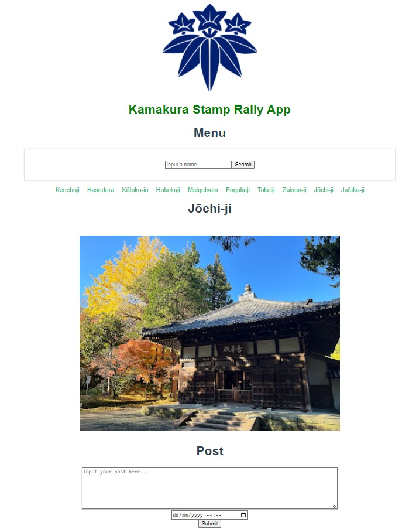

<div id="top"></div>
<!--
*** Thanks for checking out the Best-README-Template. If you have a suggestion
*** that would make this better, please fork the repo and create a pull request
*** or simply open an issue with the tag "enhancement".
*** Don't forget to give the project a star!
*** Thanks again! Now go create something AMAZING! :D
-->


<!-- PROJECT SHIELDS -->
<!--
*** I'm using markdown "reference style" links for readability.
*** Reference links are enclosed in brackets [ ] instead of parentheses ( ).
*** See the bottom of this document for the declaration of the reference variables
*** for contributors-url, forks-url, etc. This is an optional, concise syntax you may use.
*** https://www.markdownguide.org/basic-syntax/#reference-style-links

[![Contributors][contributors-shield]][contributors-url]
[![Forks][forks-shield]][forks-url]
[![Stargazers][stars-shield]][stars-url]
[![Issues][issues-shield]][issues-url]
[![MIT License][license-shield]][license-url]
[![LinkedIn][linkedin-shield]][linkedin-url]
Here's a blank template to get started: To avoid retyping too much info. Do a search and replace with your text editor for the following: `richardpbCC`, `kamakura-stamp-rally`, `twitter_handle`, `linkedin_username`, `email`, `email_client`, `Kamakura Stamp Rally`, `project_description`
-->


<!-- PROJECT LOGO -->
<br />
<div align="center">
  <a href="https://github.com/richardpbCC/kamakura-stamp-rally">
    
  </a>

<h3 align="center">Kamakura Stamp Rally</h3>

  <p align="center">
    A Full Stack app which lets the user visually track and record details of their visits <br> to the many Shrines and Temples in the historical Japanese city of Kamakura
    <br />
    <a href="https://github.com/richardpbCC/kamakura-stamp-rally"><strong>Explore the docs »</strong></a>
    <br />
    <br />
  </p>
</div>

<!-- TABLE OF CONTENTS -->
<details>
  <summary>Table of Contents</summary>
  <ol>
    <li>
      <a href="#about-the-project">About The Project</a>
      <ul>
        <li><a href="#built-with">Built With</a></li>
      </ul>
    </li>
    <li>
      <a href="#getting-started">Getting Started</a>
      <ul>
        <li><a href="#prerequisites">Prerequisites</a></li>
        <li><a href="#installation">Installation</a></li>
      </ul>
    </li>
    <li><a href="#usage">Usage</a></li>
    <li><a href="#roadmap">Roadmap</a></li>
    <li><a href="#contributing">Contributing</a></li>
    <li><a href="#license">License</a></li>
    <li><a href="#contact">Contact</a></li>
    <li><a href="#acknowledgments">Acknowledgments</a></li>
  </ol>
</details>


<!-- ABOUT THE PROJECT -->
## About The Project
"This was created during my time as a student at Code Chrysalis."

##Please note that this project is still a work in progreess##
</br>
Kamakura Stamp Rally started as a solo MVP project during my time at Code Chrysalis. I have been continuing to develop the application since and plan to implement several new features including user authentication and Google Maps navigation. Please see the <a href=#road-map>Road Map</a> below for a full list if planned features.   

<div align="center">

</div>

<p align="right">(<a href="#top">back to top</a>)</p>


### Built With

* [Vue.js](https://vuejs.org/)
* [Node.js](https://nodejs.org/en/)
* [Express.js](https://expressjs.com/)
* [Knex.js](https://knexjs.org/)
* [PostgreSQL](https://www.postgresql.org/)

<p align="right">(<a href="#top">back to top</a>)</p>


<!-- GETTING STARTED -->
## Getting Started

To get a local copy up and running follow these simple example steps.

### Prerequisites

This is an example of how to list things you need to use the software and how to install them.
* npm
  ```sh
  npm install npm@latest -g
  ```

### Installation

1. Clone the repo
   ```sh
   git clone https://github.com/richardpbCC/kamakura-stamp-rally.git
   ```
2. Install NPM packages
   ```sh
   npm install

<!--```
4. Enter your API in `config.js`
   ```js
   const API_KEY = 'ENTER YOUR API';
   ```
-->
<p align="right">(<a href="#top">back to top</a>)</p>


<!-- USAGE EXAMPLES 
## Usage

Use this space to show useful examples of how a project can be used. Additional screenshots, code examples and demos work well in this space. You may also link to more resources.

_For more examples, please refer to the [Documentation](https://example.com)_

<p align="right">(<a href="#top">back to top</a>)</p>
-->


<!-- ROADMAP -->
<div id = road-map></div>

## Roadmap

  
- [ ] Integrate Google Maps API for navigation
- [ ] Integrate session storage
- [ ] Add feature to show a list of "stamps" for all locations visited
- [ ] Impletment user authentication
  - [ ] Save individual user posts to database
  - [ ] Save visited status for each location
  - [ ] Save list of stamps for each user
    

See the [open issues](https://github.com/richardpbCC/kamakura-stamp-rally/issues) for a full list of proposed features (and known issues).

<p align="right">(<a href="#top">back to top</a>)</p>


<!-- CONTRIBUTING -->
## Contributing

If you have a suggestion that would make this better, please fork the repo and create a pull request. You can also simply open an issue with the tag "enhancement".
Don't forget to give the project a star! Thanks again!

1. Fork the Project
2. Create your Feature Branch (`git checkout -b feature/AmazingFeature`)
3. Commit your Changes (`git commit -m 'Add some AmazingFeature'`)
4. Push to the Branch (`git push origin feature/AmazingFeature`)
5. Open a Pull Request

<p align="right">(<a href="#top">back to top</a>)</p>


<!-- LICENSE 
## License

Distributed under the MIT License. See `LICENSE.txt` for more information.

<p align="right">(<a href="#top">back to top</a>)</p>
-->


<!-- CONTACT 
## Contact

Richard - [@twitter_handle](https://twitter.com/twitter_handle) - email@email_client.com

Project Link: [https://github.com/richardpbCC/kamakura-stamp-rally](https://github.com/richardpbCC/kamakura-stamp-rally)

<p align="right">(<a href="#top">back to top</a>)</p>
-->


<!-- ACKNOWLEDGMENTS 
## Acknowledgments

* []()
* []()
* []()

<p align="right">(<a href="#top">back to top</a>)</p>
-->


<!-- MARKDOWN LINKS & IMAGES -->
<!-- https://www.markdownguide.org/basic-syntax/#reference-style-links -->
[contributors-shield]: https://img.shields.io/github/contributors/richardpbCC/kamakura-stamp-rally.svg?style=for-the-badge
[contributors-url]: https://github.com/richardpbCC/kamakura-stamp-rally/graphs/contributors
[forks-shield]: https://img.shields.io/github/forks/richardpbCC/kamakura-stamp-rally.svg?style=for-the-badge
[forks-url]: https://github.com/richardpbCC/kamakura-stamp-rally/network/members
[stars-shield]: https://img.shields.io/github/stars/richardpbCC/kamakura-stamp-rally.svg?style=for-the-badge
[stars-url]: https://github.com/richardpbCC/kamakura-stamp-rally/stargazers
[issues-shield]: https://img.shields.io/github/issues/richardpbCC/kamakura-stamp-rally.svg?style=for-the-badge
[issues-url]: https://github.com/richardpbCC/kamakura-stamp-rally/issues
[license-shield]: https://img.shields.io/github/license/richardpbCC/kamakura-stamp-rally.svg?style=for-the-badge
[license-url]: https://github.com/richardpbCC/kamakura-stamp-rally/blob/master/LICENSE.txt
[linkedin-shield]: https://img.shields.io/badge/-LinkedIn-black.svg?style=for-the-badge&logo=linkedin&colorB=555
[linkedin-url]: https://linkedin.com/in/linkedin_username
[product-screenshot]: images/screenshot.png
